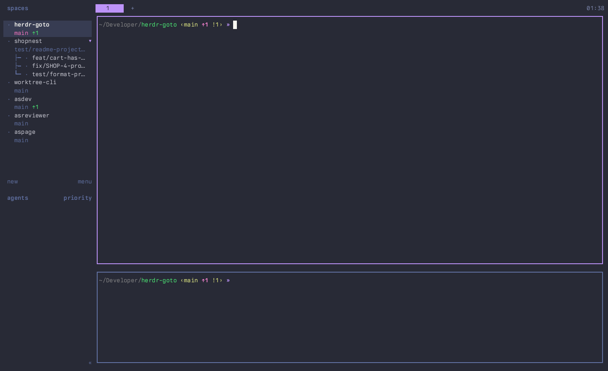

# asgoto

A custom tree-style switcher across herdr repos, worktrees and panes, used as a
replacement for herdr's native "goto" navigator. Built because the native goto
rendered too much and didn't focus its search by default. It runs as a herdr
plugin pane.



## Install as a herdr plugin

Requires herdr >= 0.7.5 on macOS or Linux:

```bash
herdr plugin install asumaran/asgoto
```

The install's build step (`scripts/fetch-binary.sh`) downloads the prebuilt
binary from the GitHub release matching the manifest's version, so no Go
toolchain is needed on macOS or Linux (arm64 and amd64). On platforms without a release asset it
falls back to `go build` (then Go is required); if neither path works the
install aborts.

To always compile locally instead of running the prebuilt binary (requires Go):

```bash
ASGOTO_BUILD_FROM_SOURCE=1 herdr plugin install asumaran/asgoto
```

Then bind a key to the plugin action (herdr has no `plugin_pane` keybind type,
so the pane is opened through the `open` action) in `~/.config/herdr/config.toml`:

```toml
[[keys.command]]
key = ["prefix+f", "ctrl+alt+f"]
type = "plugin_action"
command = "asumaran.asgoto.open"
description = "asgoto (bubbletea tree: type to search)"
```

The pane opens as a session-modal `popup` (55% x 50%, sized in the manifest)
with keyboard focus. herdr injects `HERDR_BIN_PATH` / `HERDR_SOCKET_PATH` (so
the binary talks to the same herdr server) and `HERDR_PLUGIN_STATE_DIR`, where
runtime state (`state.json`, `prcache.json`) lives.

## Keys

| Key | Action |
| --- | --- |
| type | fuzzy search |
| `↑` `↓`, `ctrl+p` `ctrl+n` | move |
| PgDn/PgUp | move a page |
| `alt+↑` `alt+↓`, Home/End | top or bottom of the list |
| `?` while the filter is empty, `f1` | expand the help line into every key (`esc` folds it) |
| `enter` | switch to the selected row |
| `ctrl+a` | show or hide panes |
| `ctrl+s` | switch between space order and priority order |
| `esc`, `ctrl+c`, `q` with an empty filter | quit |
| click, mouse wheel | move the cursor (never selects) |

Both toggles are remembered between sessions.

## What it shows

The list is a tree: each repo (its main checkout) with its worktrees under
it. Panes are hidden until you press `ctrl+a`. The exception is a pane running
a foreground command (`pnpm nx dev app`, `vitest`, ...). That one is always
listed, labelled by the command, with the TCP ports it listens on at the right
(`:3000`).

Repo rows are named after the repo. Worktree rows are named after the branch
checked out in them, because the folder is only the slug of the branch the
worktree was created for and goes stale after a `git checkout`. When the
folder no longer matches the branch it shows dimmed at the right, so a
worktree created as `foo` and now on `as-foo-bar-test` reads
`as-foo-bar-test  foo`. A detached HEAD falls back to the folder.

Around each name:

- The left gutter holds the agent status. A repo or worktree row shows the
  most urgent status among its panes. The glyphs follow herdr's
  `ui.status_indicators`: `dots` (`●` blocked, working or done, `○` idle, `·`
  none) or `symbols` (`×` blocked, `◐` working, `✓` done). With herdr's
  `dracula` theme the colors are that theme's palette; with any other theme
  they are the terminal's ANSI red, yellow, teal and green.
- The prefix is the Jira ticket (`KEY-123`, taken from the branch, then the
  folder, then the PR title) and the branch's PR number colored by state: open
  green, draft dim, merged purple, closed red.
- The right column reads like a git shell prompt: the branch (on repo rows),
  then `↑2` to push and `↓1` to pull, then `+n` staged, `!n`
  unstaged and `?n` untracked. Anything at zero is hidden.

## Search

Typing filters the tree with fuzzy matching. A query of several words matches them in any order (`login fix` finds "fix login flow"), and a word starting with `'` must occur as typed instead of fuzzily (`'dex`). In the tree a word may match the row and another one of its parents (`herdr fix` finds the fix worktree of herdr). The query is matched against the
row name, the branch, the worktree folder, the Jira ticket, the PR number and
the listening ports, so "1234" finds the row showing #1234 and "3000" finds
whoever holds that port. Matching rows keep their ancestors visible and the
cursor jumps to the best match. On ties, repos and worktrees outrank panes,
so typing "h" lands on herdr.

Digits are plain search text. There is no "press 1-9 to jump to a repo"
shortcut because it would conflict with searching by PR or ticket number.

## Order

By default repos follow the sidebar's order, and the worktrees inside a repo
go oldest first by checkout creation time, which tracks PR order in practice.

`ctrl+s` switches to priority order. It is herdr's Agents panel
`agent_panel_sort = "priority"` applied to every level of the tree: blocked
first, then done, working, idle, and rows without an agent. Within a status
the most recent state change goes first. A repo's own panes stay above its
worktrees. The frame's top border shows the rows listed out of the total and which
order is active (`sort: spaces` or `sort: priority`).

## Selecting

The cursor starts on the space asgoto was opened from, so `enter` on an empty
query changes nothing. `enter` on a repo or worktree switches to that space
without changing which pane is focused inside it. You land where you left it,
and the agent pane is never autofocused. `enter` on a pane focuses that pane.

## Optional tools

PR numbers need `gh` (authenticated) and a GitHub remote. Ports need `lsof`.
Without them asgoto still works and leaves those columns out.

The git hints come from one `git status` per checkout, run in the background
once the list is on screen. The last known values are cached, so they paint
right away and get corrected if anything changed. On a large repo `git status`
costs about 1s of CPU, which `core.fsmonitor=true` removes.

## Develop

```bash
go build -o asgoto .             # local build inside the repo
./asgoto -dump                   # print the tree (no TUI), for debugging without a TTY
./asgoto -version                # print the embedded version
go vet ./... && go test ./...
scripts/pty-check.py ./asgoto   # end-to-end TUI check on a pty (python3 + pyte)
```

It is a single static Go binary with no runtime deps: Bubble Tea v2 and bubbles v2
(`textinput`, `viewport`, `key`, `help`) for the TUI, lipgloss v2 for styling
and `sahilm/fuzzy` for matching. The tree, the filter that keeps ancestors
and the grouping are custom. [`docs/DESIGN.md`](docs/DESIGN.md) has the
implementation notes: tree building, caches, the right column and the herdr
commands asgoto depends on.

To run your working copy as the installed plugin, `herdr plugin link "$PWD"`
from the checkout registers it. `plugin link` does **not** run build
commands, so build the binary yourself first with `go build -o asgoto .`. Don't
run `fetch-binary.sh` for this: it would fetch the released build instead of
your changes.

## Release

```bash
scripts/release.sh 0.2.0       # gate, tag, push, publish the GitHub release; CI attaches the binary
```

The release assets (`asgoto-<os>-<arch>`, macOS and Linux, arm64 and amd64) are
what `fetch-binary.sh` downloads on plugin installs, so every release must keep
attaching them.
